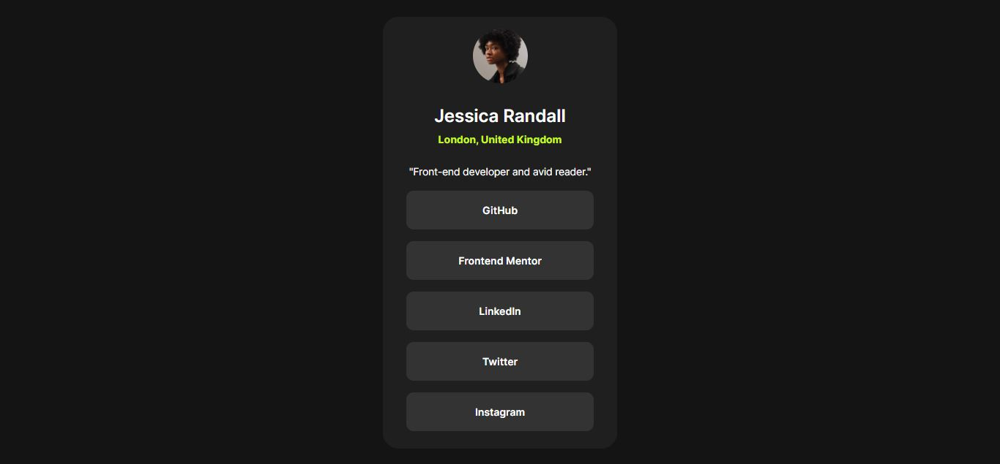

# Frontend Mentor - Social links profile solution

This is a solution to the [Social links profile challenge on Frontend Mentor](https://www.frontendmentor.io/challenges/social-links-profile-UG32l9m6dQ).

## Table of contents

- [Overview](#overview)
  - [The challenge](#the-challenge)
  - [Screenshot](#screenshot)
  - [Links](#links)
- [My process](#my-process)
  - [Built with](#built-with)
  - [What I learned](#what-i-learned)
  - [Continued development](#continued-development)
  - [Useful resources](#useful-resources)

## Overview

### The challenge

Users should be able to:

- See hover and focus states for all interactive elements on the page

### Screenshot

### Links

- Live Site URL: [GitHub Pages]([https://your-live-site-url.com)](https://marcuscs00.github.io/fem-social-links-profile/
)

## My process

### Built with

- Basic HTML and CSS

### What I learned

I learned how to use the `:not()` and `:first-child` psuedo-classes.

### Continued development

I want to optimize my website for accessibility and responsive design. I also want to make the width of the social links card be the same size as in the design.

### Useful resources

- [Grace Snow's Blog Post about Padding and Margin](https://fedmentor.dev/posts/padding-margin/) - Helped me understand basic information about margin and how to use it to space out HTML elements.
